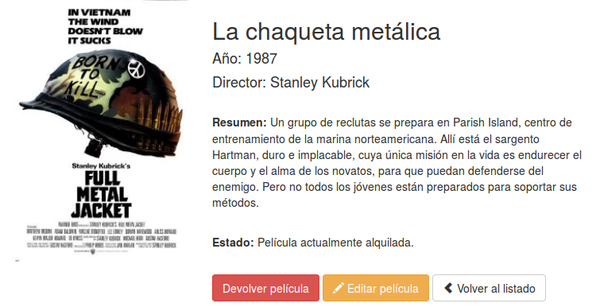

# Controladores, filtros y formularios


<!-- ************************************************************************-->
# Aplicar filtros a las rutas

Laravel nos permite aplicar filtros a las rutas que definimos en el fichero `routes.php`. Esta característica es muy útil para por ejemplo validar que solo puedan acceder usuarios validados a determinadas áreas de nuestro sitio web o realizar otro tipo de validaciones.


<!-- ************************************** -->
## Definir filtros

Laravel incluye por defecto algunos de los filtros más comunes, los cuales están definidos en el fichero `app/filters.php`. Por ejemplo incluye los filtros `auth` y `guest` que nos permiten validar si el usuario que visita la ruta está _logueado_ o no, o el filtro `csrf` para protegernos de ataques tipo _cross-site request forgery_ como veremos más adelante.

Pero además de estos filtros nos permite definir nuestros propios filtros. Para esto tenemos que añadir el filtro al fichero `app/filters.php`, por ejemplo:


```php
Route::filter('old', function()
{
    if (Input::get('age') < 200)
    {
        return Redirect::to('home');
    }
});
```

Si el filtro devuelve una respuesta, una redirección u otra cosa, entonces esta se considerará la respuesta de la petición. Si no devuelve nada entonces se continuará con el procesamiento normal.


<!-- ************************************** -->
## Asignar un filtro a una ruta

Para añadir un filtro a una ruta tenemos que editar el fichero `routes.php` e incluir, para la ruta en cuestión el filtro como un array asociativo de la forma:

```php
Route::get('user', array('before' => 'old', function()
{
    return 'Tienes más de 200 años!';
}));
```

Donde _before_ indica que el filtro se ejecutará antes que el procesamiento de la función respuesta (en general será siempre así) y `old` es el nombre del filtro (el que habíamos creado antes de ejemplo, también podría ser `auth`, `guest`, `csrf` o alguno otro que nos hayamos definido).


Para añadir un filtro cuando indicamos que la ruta la procese un controlador lo tenemos que hacer de la forma:

```php
Route::get('user', array('before' => 'old', 'uses' => 'UserController@showProfile'));
```

Para añadir varios filtros a una ruta simplemente los tenemos que separar mediante `|`:

```php
Route::get('user', array('before' => 'auth|old', function()
{
    return 'Estás logueado y tienes más de 200 años!';
}));
```

El comando `php artisan routes`, además de mostrar una tabla con las rutas definidas para la aplicación, también incluye los filtros que tienen asignadas estas rutas. Por lo tanto es muy útil para comprobar que todas las rutas y filtros que hemos definido se hayan creado correctamente.


<!-- ************************************** -->
## Grupos de rutas

Laravel permite aplicar un filtro a un grupo de rutas agrupándolas todas dentro de un `Route::group`, de esta forma solo tendremos que especificar el filtro una vez y además nos permitirá dividir las rutas en secciones (distinguiendo mejor a que secciones se les está aplicando un filtro):

```php
Route::group(array('before' => 'auth'), function()
{
    Route::get('/', function()
    {
        //
    });

    Route::get('user/profile', function()
    {
        //
    });
});
```


<!-- ************************************************************************-->
# Redirecciones

Como respuesta a una petición también podemos devolver una redirección. Esta opción será interesante cuando, por ejemplo, el usuario no esté _logueado_ y lo queramos redirigir al formulario de login, o cuando se produzca un error en la validación de una petición y queramos redirigir a otra ruta. Para esto simplemente tenemos que utilizar:


```php
return Redirect::to('user/login');

// O redirigir a un método de un controlador:

return Redirect::action('HomeController@index');

// Si queremos añadir parámetros al llamar al método podemos hacer:
return Redirect::action('UserController@profile', array(1));
return Redirect::action('UserController@profile', array('user' => 1));
```

Las redirecciones también se suelen utilizar tras obtener algún error en la validación del formulario. En este caso, para que al mostrar el formulario con los errores producidos podamos añadir los datos que había escrito el usuario tendremos que añadir:

```php
return Redirect::to('form')->withInput();

// O para reenviar los datos de entrada excepto algunos:
return Redirect::to('form')->withInput(Input::except('password'));
```


<!-- ************************************************************************-->
<!-- ************************************************************************-->
<!-- ************************************************************************-->
<!-- ************************************************************************-->


<!-- ************************************************************************-->
# Ejercicios

En los ejercicios de esta parte vamos a continuar con el sitio Web que empezamos para la gestión de un videoclub. En primer lugar añadiremos los controladores y métodos asociados a cada ruta, y posteriormente también completaremos las vistas usando las plantillas _Blade_ y formularios.


<!-- ************************************* -->
## Ejercicio 1 - Controladores (1 punto)

En este primer ejercicio vamos a crear los controladores necesarios para gestionar nuestra aplicación y actualizaremos el fichero de rutas para que los utilice.

En primer lugar creamos los dos controladores que nos van a hacer falta: `CatalogController.php` y `UserController.php`. Como base podemos coger el controlador que viene de ejemplo `HomeController.php` y renombrarlo. Este controlador ya extiende de la clase base `BaseController` y tiene un método creado. Además nos tenemos que acordar de cambiar también el nombre de la clase por el que corresponda.

A continuación vamos a añadir los métodos que vamos a necesitar en estos controladores. En `UserController.php` tendremos que crear tres métodos y en `CatalogController.php` cuatro, en la siguiente tabla resumen podemos ver un listado de los métodos por controlador y las rutas que tendrán asociadas:

| Ruta              | Controlador       | Método    |
| ----------------- | ----------------- | --------- |
| /                 | UserController    | getHome   |
| login             | UserController    | getLogin  |
| logout            | UserController    | getLogout |
| catalog           | CatalogController | getIndex  |
| catalog/show/{id} | CatalogController | getShow   |
| catalog/create    | CatalogController | getCreate |
| catalog/edit/{id} | CatalogController | getEdit   |

Acordaros que los métodos `getShow` y `getEdit` tendrán que recibir como parámetro el `$id` del elemento a mostrar, por lo que la definición del método en el controlador tendrá que ser como la siguiente:

```php
public function getShow($id)
{
	return View::make('catalog.show', array('id'=>$id));
}
```


Por último vamos a cambiar el fichero de rutas `routes.php` para que todas las rutas que teníamos definidas apunten a los nuevos métodos de los controladores, por ejemplo:

```php
Route::get('/', 'UserController@getHome');
```

El return con la generación de la vista que teníamos puesto para cada ruta lo moveremos al método del controlador correspondiente.


<!-- ************************************* -->
## Ejercicio 2 - Completar las vistas de usuario (0.5 puntos)

En este ejercicio vamos a completar los métodos del controlador de usuarios y sus vistas asociadas:

**Método getHome**

En este método de momento solo vamos a hacer una redirección a la acción de _login_: `return Redirect::action('UserController@getLogin');`. Más adelante tendremos que distinguir si el usuario está logueado o no.

**Método getLogout**

En el método para cerrar la sesión también haremos una redirección a la acción de _login_. Más adelante tendremos que completar este método para que cierre la sesión abierta.

**Método getLogin**

En este método vamos a modificar su vista asociada para incluir el formulario de acceso. En los materiales de los ejercicios podéis encontrar una plantilla `login.blade.php` para esta vista con casi todas las secciones ya completadas (solo faltan un par de TODOs). Esta plantilla además tiene ya aplicados los estilos de Bootstrap. De momento solo tenéis que completar la parte visual, no es necesario que el formulario realice ninguna acción más.


<!-- ************************************* -->
## Ejercicio 3 - Completar las vistas del catálogo (1.5 puntos)

En este ejercicio vamos a completar los métodos del controlador del catálogo y todas sus vistas asociadas:


**Método getIndex**

Este método tiene que mostrar un listado de todas las películas que tiene el videoclub. El listado de películas lo podéis obtener del fichero `array_peliculas.php` facilitado con los materiales. Este array de películas lo podéis copiar de momento como variable miembro de la clase (más adelante las almacenaremos en la base de datos). En el método del controlador simplemente tendremos que modificar la generación de la vista para pasarle este array de películas completo (`$this->arrayPeliculas`).

Y en la vista correspondiente simplemente tendremos que incluir el siguiente trozo de código en su sección `content`:

```php
<div class="row">

	@foreach( $arrayPeliculas as $key => $pelicula )
	<div class="col-xs-6 col-sm-4 col-md-3 text-center">

		<a href="{{URL::to('/catalog/show/' . $key )}}">
			
			<h4 style="min-height:45px;margin:5px 0 10px 0">
				{{$pelicula['title']}}
			</h4>
		</a>

	</div>
	@endforeach

</div>
```

Como se puede ver en el código, en primer lugar se crear una fila (usando el sistema de rejilla de Bootstrap) y a continuación se realiza un bucle _foreach_ utilizando la notación de _Blade_ para iterar por todas las películas. Para cada película obtenemos su posición en el array y sus datos asociados, y generamos una columna para mostrarlos. Es importante que nos fijemos en como se itera por los elementos de un array de datos y en la forma de acceder a los valores. Además se ha incluido un enlace para que al pulsar sobre una película nos lleve a la dirección `/catalog/show/{$key}`, siendo `key` la posición de esa película en el array.


**Método getShow**

Este método se utiliza para mostrar la vista detalle de una película. Hemos de tener en cuenta que el método correspondiente recibe un identificador que (de momento) se refiere a la posición de la película en el array. Por lo tanto, tendremos que coger dicha película del array (`$this->arrayPeliculas[$id]`) y pasársela a la vista.

En esta vista vamos a crear dos columnas, la primera columna para mostrar la imagen de la película y la segunda para incluir todos los detalles. A continuación se incluye la estructura HTML que tendría que tener esta pantalla:

```html

<div class="row">

	<div class="col-sm-4">

		{{-- TODO: Imagen de la película --}}

	</div>
	<div class="col-sm-8">

        {{-- TODO: Datos de la película --}}

	</div>
</div>
```

En la columna de la derecha se tendrán que mostrar todos los datos de la película. Para mostrar el estado de la película consultaremos el valor `rented` del array, el cual podrá tener dos casos:
* En caso de estar disponible (false) aparecerá el estado "Película disponible" y un botón azul para "Alquilar película".
* En caso de estar alquilada (true) aparecerá el estado "Película actualmente alquilada" y un botón rojo para "Devolver película".

Además tenemos que incluir dos botones más, un botón que nos llevará a editar la película y otro para volver al listado de películas.

> Nota: los botones de alquilar/devolver de momento no tienen que funcionar.
> Acordaros que en Bootstrap podemos transformar un enlace en un botón, simplemente aplicando las clases "btn btn-default" (más info en: http://getbootstrap.com/css/#buttons).


Esta pantalla finalmente tendría que tener una apariencia similar a la siguiente:




**Método getCreate**

Este método mostrará el formulario para añadir una película, el cual tendrá que tener los siguientes campos:

| Label    | Name      | Tipo de campo |
| -------- | --------- | ------------- |
| Título   | title     | text          |
| Año      | year      | text          |
| Director | director  | text          |
| Poster   | poster    | text          |
| Resumen  | synopsis  | textarea      |

Además añadiremos un botón al final con el texto "Añadir película".

> Como base podemos coger el formulario que hemos creado para la vista de login y modificarlo para adaptar a esta vista.

> De momento el formulario no tendrá que funcionar ni enviar nada. Más adelante completaremos esta funcionalidad.


**Método getEdit**

Este método permitirá modificar el contenido de una película. El formulario será exactamente igual al de añadir película, así que lo podemos copiar y pegar en esta vista y simplemente cambiar el título y el texto del botón de envío. De momento no tendremos que hacer nada más, más adelante lo completaremos para que se complete con los datos de la película a editar.


