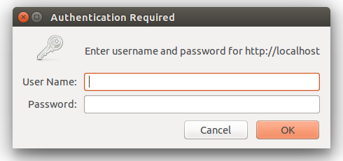

# Laravel 5 - Paquetes, Rest y Curl


<!-- ************************************************************************-->
# Instalación de paquetes

Además de todas las utilidades que incorpora Laravel y que podemos utilizar directamente sin instalar nada más, también nos permite añadir de forma muy sencilla paquetes para complementar su funcionalidad.

Para instalar un paquete tenemos dos opciones, utilizar el comando de `composer`:

```bash
sudo composer require <nombre-del-paquete-a-instalar>
```

O editar el fichero `composer.json` de la raíz de nuestro proyecto, añadir el paquete en su sección "`require`" y  por último ejecutar el comando:


```bash
sudo composer update
```

Esta última opción es más interesante ya que nos permitirá una mayor configuración, por ejemplo, indicar la versión del paquete o repositorio, etc.

La lista de todos los paquetes disponibles la podemos encontrar en "https://packagist.org", en la cual permite realizar búsquedas, ver el número de instalaciones de un paquete, etc.

Algunos de los paquetes más utilizados en Laravel son:

| Nombre        | Descripción                     | Url                        |
| ------------- | ------------------------------- | -------------------------- |
| L4 Generators | Auto generación de código       | https://github.com/JeffreyWay/Laravel-4-Generators |
| Debugbar      | Barra de depuración de Laravel  | https://github.com/barryvdh/laravel-debugbar |
| L4 IDE Helper | Helper para IDEs                | https://github.com/barryvdh/laravel-ide-helper |
| Confide       | Autenticación                   | https://github.com/Zizaco/confide |
| Entrust       | Roles, permisos                 | https://github.com/Zizaco/entrust |
| Sentry        | Autenticación, roles, permisos  | https://github.com/cartalyst/sentry |
| Ardent        | Modelos auto-validados          | https://github.com/laravelbook/ardent |
| MongoDB       | Extensión para soportar MongoDB | https://github.com/jenssegers/laravel-mongodb |
| Notification  | Notificaciones                  | https://github.com/edvinaskrucas/notification |
| Former        | Automatización de formularios   | https://github.com/anahkiasen/former |
| Image         | Manipulación de imágenes        | https://github.com/Intervention/image |
| Stapler       | Manipulación de ficheros        | https://github.com/CodeSleeve/laravel-stapler |
| User Agent    | Obtener info. del _user agent_  | https://github.com/jenssegers/laravel-agent |
| OAuth 4 Laravel | OAuth para Laravel            | https://github.com/artdarek/oauth-4-laravel |
| Rocketeer     | Despliegue en servidor con Git  | https://github.com/Anahkiasen/rocketeer |
| Sitemap       | Genearción del Sitemap          | https://github.com/RoumenDamianoff/laravel-sitemap |
| Excel         | Trabajar con Excel y csv        | https://github.com/Maatwebsite/Laravel-Excel |
| DOMPdf        | Trabajar con PDF                | https://github.com/barryvdh/laravel-dompdf |


Una vez añadido el paquete tendremos que modificar también el fichero de configuración `app/config/app.php`, en su sección `providers` y `aliases`, para que la plataforma encuentre el paquete que acabamos de añadir. Los detalles de configuración en general se encuentran indicados en la web o repositorio de GitHub de cada proyecto.


<!-- ********************************* -->
## Ejemplo: instalación de paquete de notificaciones

Por ejemplo, para instalar el paquete "Notification" de _edvinaskrucas_ tendríamos que editar el fichero `composer.json` y en su sección `require` añadir la siguiente línea:

```json
"edvinaskrucas/notification": "3.*"
```

> Al añadir el paquete al fichero `composer.json` tenemos que llevar mucho cuidado de añadir una coma como separador excepto al final del último elemento.


Una vez añadido ejecutamos el siguiente comando para instalar el paquete:

```bash
sudo composer update
```

Y después de instalar tendríamos que editar el fichero `app/config/app.php` para añadir, en la sección `providers`, la siguiente línea:

```php
'Krucas\Notification\NotificationServiceProvider'
```

Y en la sección `aliases` lo siguiente:

```php
'Notification' => 'Krucas\Notification\Facades\Notification'
```

Con esto ya tendríamos instalada esta librería y podríamos empezar a utilizarla. Por ejemplo, para añadir una notificación desde un controlador podemos utilizar los siguientes métodos:

```php
Notification::success('Success message');
Notification::error('Error message');
Notification::info('Info message');
Notification::warning('Warning message');
```

Y para mostrar las notificaciones, desde una vista (preferiblemente desde el _layout_ principal), añadiríamos el siguiente código:

```php
{{ Notification::showAll() }}
```


<!-- ************************************************************************-->
<!--
# Unión entre formulario y modelo de datos

Laravel incluye una forma muy sencilla de rellenar de datos un formulario que está basado en un modelo, simplemente tendremos que abrir el formulario utilizando el método `Form::model` en lugar de `Form::open`, pasándole como primer parámetro una instancia del modelo. Por ejemplo:

```php
{{ Form::model($user, array('action' => array('Controller@method', $user->id))) }}
```

El resto de parámetro de este método son exactamente iguales a los que utilizaríamos con `Form::open`.

Al utilizar este método, todos los campos del formulario cuyo nombre coincida con los del modelo serán rellenados con los datos del campo correspondiente que se ha pasado por parámetro. Pero no solo eso, sino que si se produce un error y se envía al usuario otra vez al formulario (con la opción de `withInput`), entonces el formulario automáticamente cogerá los valores que escribió (o modificó) el usuario y los pondrá (dándoles precedencia sobre los valores que ya estaban en el modelo).


> Nota: Para cerrar el formulario tenemos que seguir usando el mismo método que antes: `Form::close`
-->


<!-- ************************************************************************-->
# Controladores de recursos _RESTful_

Laravel incorpora un tipo especial de controlador, llamado controlador de recuso (_recource controller_), que facilita la construcción de controladores tipo _RESTful_. Para esto simplemente tendríamos que usar el comando de artisan `php artisan controller:make <nombre-controlador>` para crear el controlador y añadir la ruta al fichero de rutas `routes.php` usando `Route::resource`.

Por ejemplo, para crear un controlador para la gestión de imágenes almacenadas en la aplicación, en primer lugar ejecutaríamos el siguiente comando:

```bash
$ php artisan controller:make PhotoController
```

Esto crearía el controlador `PhotoController` en la carpeta `app/controllers`. Lo único que nos faltaría es registrar las rutas asociadas añadiendo al fichero `routes.php` la siguiente línea:

```php
Route::resource('photo', 'PhotoController');
```

Esta sola línea de ruta crea por si sola múltiples rutas para gestionar todos los tipos de peticiones RESTful. Además, el controlador creado mediante Artisan estará preparado con todos los métodos necesarios para responder a todos los tipos de peticiones. En la siguiente tabla se muestra un resumen de todas las rutas generadas, el tipo de petición a la que responden y la acción que realizan en el controlador:


| Verbo     | Ruta                   | Acción  | Controlador / método |
| --------- | ---------------------- | ------- | --------------- |
| GET       | /photo                 | index   | PhotoController@index  |
| GET    	| /photo/create 	        | create  | PhotoController@create |
| POST 	    | /photo 	            | store   | PhotoController@store  |
| GET 	    | /photo/{resource} 	    | show 	  | PhotoController@show   |
| GET 	    | /photo/{resource}/edit | edit 	  | PhotoController@edit   |
| PUT/PATCH | /photo/{resource} 	    | update  | PhotoController@update |
| DELETE 	| /photo/{resource} 	    | destroy | PhotoController@destroy|


<!-- *********************************** -->
## Restringir rutas en un controlador RESTful

En ocasiones nos interesará declarar solamente un subconjunto de las acciones que soporta REST, para esto, al declarar la ruta tipo `resource` tenemos que añadir un tercer parámetro con la opción `only` (para que solo se creen esas rutas) o `except` (para que se creen todas las rutas excepto las indicadas), por ejemplo:

```php
Route::resource('photo', 'PhotoController',
                array('only' => array('index', 'show')));

Route::resource('photo', 'PhotoController',
                array('except' => array('create', 'store', 'update', 'destroy')));
```


Además, a la hora de generar el controlador usando Artisan también podemos indicar de la misma forma que no nos genere todos los métodos:

```php
$ php artisan controller:make PhotoController --only=index,show

$ php artisan controller:make PhotoController --except=index
```


<!-- *********************************** -->
## Controladores de recursos anidados

Para "anidar" controladores de recursos se tiene que utilizar el punto "." como separador de los recursos en la declaración de la ruta, por ejemplo:

```php
Route::resource('photos.comments', 'PhotoCommentController');
```

Esta ruta representaría que el recurso "_comments_" estaría anidado o contenido en el recurso "_photos_".

Las rutas generadas para este tipo de recursos siguen el siguiente patrón: `photos/{photoResource}/comments/{commentResource}`, donde se tiene que especificar el identificador de ambos recursos para poder acceder.

Los controladores asociados recibirían en este caso dos identificadores, primero el del recurso base y segundo el del recurso anidado:

```php
class PhotoCommentController extends BaseController
{
    public function show($photoId, $commentId)
    {
        //
    }
}
```


<!-- *********************************** -->
## Rutas adicionales en un controlador tipo RESTful

Si queremos definir rutas adicionales para un controlador de recursos simplemente las tenemos que añadir al fichero de rutas `routes.php` antes que las rutas del propio recurso, por ejemplo:

```php
Route::get('photos/popular', 'PhotoController@getPopular');
Route::resource('photos', 'PhotoController');
```


<!-- ************************************************************************-->
# Probar nuestra API con _cURL_

Para probar una API lo podemos hacer fácilmente utilizando el comando `curl` desde consola, el cual permite enviar peticiones de cualquier tipo a una URL, especificar las cabeceras, parámetros, etc.

Por ejemplo, para realizar una petición tipo GET a una URL simplemente tenemos que hacer:

```bash
$ curl -i http://localhost/recurso

HTTP/1.1 200 OK
Transfer-Encoding: chunked
Date: Fri, 27 Jul 2012 05:11:00 GMT
Content-Type: text/plain

¡Hola Mundo!
```

Donde la opción `-i` indica que se muestren las cabeceras de la respuesta.

Opcionalmente, al hacer la petición podemos indicar las cabeceras con el parámetro `-H`. Por ejemplo, para solicitar datos en formato JSON tenemos que hacer:

```bash
$ curl -i -H "Accept: application/json" http://localhost/recurso

HTTP/1.1 200 OK
Date: Fri, 27 Jul 2012 05:12:32 GMT
Cache-Control: max-age=42
Content-Type: application/json
Content-Length: 27

{
    "text": "¡Hola Mundo!"
}
```

Como hemos visto por defecto se realiza una petición tipo GET. Si queremos realizar otro tipo de petición lo tendremos que indicar con el parámetro `-X` seguido del método a utilizar (POST, PUT, DELETE). Además, con la opción `-d` podemos añadir los parámetros de la petición. Los parámetros tendrán que ir entre comillas y en caso de indicar varios los separaremos con `&`. Por ejemplo, para realizar una petición tipo POST con dos parámetros:

```bash
$ curl -i -H "Accept: application/json" -X POST -d "name=javi&phone=800999800" http://localhost/users
```

De la misma forma podemos hacer una petición tipo PUT (para actualizar datos) o tipo DELETE (para eliminarlos). Por ejemplo:

```bash
$ curl -i -H "Accept: application/json" -X PUT -d "name=new-name" http://localhost/users/1

$ curl -i -H "Accept: application/json" -X DELETE http://localhost/users/1
```

Para añadir más de una cabecera tenemos que indicar varias veces la opción `-H`, por ejemplo:

```bash
$ curl -i -H "Accept: application/json" -H "Content-Type: application/json" http://localhost/resource

$ curl -i -H "Accept: application/xml" -H "Content-Type: application/xml" http://localhost/resource
```

Por ejemplo, si queremos realizar una petición tipo POST que envíe código JSON y que también espere la respuesta en JSON tendríamos que indicar ambas cabeceras y añadir el JSON que queramos en los parámetros con `-d` de forma normal:

```bash
$ curl -i -H "Accept: application/json" -H "Content-Type: application/json" -X POST -d '{"title":"xyz","year":"xyz"}' http://localhost/resource
```


Como resumen, las opciones más importantes de `curl` son:

| Opción        | Descripción |
| ------------- | ----------- |
| `-i`          | Mostrar las cabeceras de respuesta |
| `-H "header"` | Configurar las cabeceras de la petición |
| `-X <type>`   | Indicar el método de la petición: POST, PUT, DELETE. Si no indicamos nada la petición será de tipo GET. |
| `-d "params"` | Añadir parámetros a la petición. Los parámetros tendrán que ir entre comillas "". Si queremos pasar varios parámetros utilizaremos como separador "`&`" |


<!-- ************************************ -->
## Plugins o extensiones

Además de `curl` también podemos utilizar otro tipo de programas para probar una API. En Firefox y Chrome podemos encontrar extensiones que nos facilitarán este tipo de trabajo. Por ejemplo, en Firefox podemos encontrar _HttpRequester_ (https://addons.mozilla.org/en-US/firefox/addon/httprequester/) o _Poster_ (https://addons.mozilla.org/en-US/firefox/addon/poster/). Una vez instalado los podremos abrir desde el menú `Herramientas`, y utilizarlo a través de una interfaz visual muy sencilla.

Para Chrome también podemos encontrar muchas extensiones si buscamos en su tienda (https://chrome.google.com/webstore/category/apps). Algunas opciones interesantes son "_Advanced REST client_" o "_Postman - REST Client_".


<!-- ************************************************************************-->
# Convertir modelos en Arrays o JSON

Laravel incluye métodos para transformar fácilmente el resultado obtenido de la consulta a un modelo de datos a formato JSON o a formato array. Esto es especialmente útil cuando estamos diseñando una API y queremos enviar los datos en formato JSON. Además, al realizar la transformación se incluirán los datos de las relaciones que se hayan cargado al hacer la consulta. Para realizar esta transformación simplemente tenemos que usar los métodos `toJson()` o `toArray()` sobre el resultado de la consulta:

```php
$user = User::first();

$arrayUsuario = $user->toArray();

$jsonUsuario = $user->toJson();
```

También podemos transformar una colección entera de datos a este formato, por ejemplo:

```php
$arrayUsuarios = User::all()->toArray();

$jsonUsuarios = User::all()->toJson();
```


En ocasiones nos interesará ocultar determinados atributos de nuestro modelo en la conversión a array o a JSON, como por ejemplo, el password o el identificador. Para hacer esto tenemos que definir el campo protegido `hidden` de nuestro modelo con el array de atributos a ocultar:

```php
class User extends Eloquent {

    protected $hidden = array('password');

    // O también podemos indicar solamente aquellos que queramos mostrar:
    //protected $visible = array('name', 'address');

}
```


<!-- ************************************************************************-->
## Respuestas especiales

Con lo que hemos visto en la sección anterior solo se realizaría la transformación a JSON, pero si queremos devolverlo como respuesta de una petición (por ejemplo, como respuesta a una petición de un método de una API), tendremos que utilizar el método `Response::json`, el cual además añadirá en la cabecera de la respuesta que los datos enviados están en formato JSON. Por ejemplo:


```php
$usuarios = User::all();

return Response::json( $usuarios );
```

Este método también puede recibir otro tipo de valores (como una variable, un array, etc.) y los transformará también a JSON para devolverlos como respuesta a la petición:

```php
return Response::json( array('name' => 'Steve', 'state' => 'CA') );
```

Si queremos especificar el código de la respuesta, por ejemplo cuando queremos indicar que ha sucedido algún error, podemos añadirlo como segundo parámetro, por ejemplo:


```php
return Response::json( array('error'=>true, 'msg'=>'Error al procesar la petición' ), 500 );
```

La lista completa de los códigos que podemos utilizar la podéis encontrar en:


http://es.wikipedia.org/wiki/Anexo:C%C3%B3digos_de_estado_HTTP


<!-- ************************************************************************-->
# Grupos de rutas con prefijo

Una opción interesante al incluir rutas en el fichero de rutas es poder agruparlas. Ya hemos visto esta opción para aplicar un determinado filtro a un grupo de rutas, pero también podemos utilizarlo para indicar un prefijo. Por ejemplo, si queremos que un grupo de rutas empiece por el prefijo `api/v1` tendríamos que hacer lo siguiente:

```php
Route::group(array('prefix' => 'api/v1'), function()
{
	Route::get('recurso',      'Controller@getRecurso');
    Route::post('recurso',     'Controller@postRecurso');
	Route::get('recurso/{id}', 'Controller@putRecurso');
	//...
});
```


<!-- ************************************************************************-->
# Autenticación HTTP básica

El sistema de autenticación HTTP básica proporciona una forma rápida de identificar a los usuarios sin necesidad de crear una página con un formulario de login. Este sistema, cuando se accede a través de la web, automáticamente mostrará una ventana emergente para solicitar los datos de acceso:



Pero es más común su utilización para proteger las rutas de una API. En este caso las credenciales se tendrían que enviar en la cabecera de la petición.

Para proteger una ruta usando el sistema de autenticación básico simplemente tenemos que añadir el filtro llamado `auth.basic` a la ruta o grupo de rutas, de la forma:

```php
Route::get('profile', array('before' => 'auth.basic', function()
{
    // Zona de acceso restringido
}));
```

Por defecto este filtro utiliza la columna `email` de la tabla de usuarios para la validación. En caso de querer utilizar otro campo tendríamos que editar el fichero de filtros `app/filters.php` y modificar el filtro `auth.basic` para pasarme como primer parámetro el nombre de la columna. Por ejemplo, si queremos utilizar la columna `username` tendríamos que hacer:

```php
Route::filter('auth.basic', function()
{
    return Auth::basic('username');
});
```

Una vez superada la autenticación básica se crea la sesión del usuario y en cliente se almacenaría una cookie con el identificador de la sesión. 

Si no queremos que la sesión se mantenga (por ejemplo, en una API si queremos solicitar siempre el usuario y contraseña), simplemente tendremos que cambiar el filtro `auth.basic` por `auth.once`, el cual funciona exactamente igual pero sin persistir la sesión del usuario.

**Importante: ** Este filtro no viene implementado por defecto en el fichero de filtros `app/filters.php`. Así que tenemos que para utilizarlo tendréis que añadir el siguiente código: 

```php
Route::filter('auth.once', function()
{
    return Auth::onceBasic('username');
});
```


<!-- ************************************************************************-->
## Pruebas con _cURL_

Si intentamos acceder a una ruta protegida mediante autenticación básica utilizando los comando de _curl_ que hemos visto obtendremos el siguiente error:

```bash
HTTP/1.1 401 Unauthorized
```

Pero _curl_ permite también indicar el usuario y contraseña añadiendo el parámetro `-u` o también `--user` (equivalente):


```bash
$ curl --user username:password http://localhost/recurso
$ curl -u username:password http://localhost/recurso
```

> Si solamente indicamos el usuario (y no el password) se nos solicitará inmediatamente, y además al introducirlo no se verá escrito en la pantalla.


<!-- ************************************************************************-->
<!-- ************************************************************************-->
<!-- ************************************************************************-->
<!-- ************************************************************************-->


<!-- ************************************************************************-->
# Ejercicios

En esta sección de ejercicios vamos a terminar la web de gestión del videoclub añadiendo notificaciones, el funcionamiento de algunos botones que faltaban y por último, una API RESTful para el acceso externo.


<!-- ************************************ -->
## Ejercicio 1 - Notificaciones (0.5 puntos)

En este primer ejercicio vamos a instalar una librería externa para mostrar las notificaciones de nuestra aplicación, para esto tenéis que seguir los pasos indicados en el apartado de teoría "Ejemplo: instalación de paquete de notificaciones".

Una vez instalado y correctamente configurado vamos a modificar los controladores para mostrar un aviso tipo `success` después de guardar y editar una película (la notificación se tendrá que añadir antes de realizar la redirección). Además también mostraremos una notificación de tipo `error` cuando se produzca un error en la autenticación del usuario.

Por último vamos a modificar la vista con el layout principal, situada en `app/views/layouts/master.blade.php`, para indicar que se muestren las notificaciones justo antes del contenido principal:

```php
<div class="container">
    {{ Notification::showAll() }}

    @yield('content')
</div>
```


<!-- ************************************ -->
## Ejercicio 2 - Completando botones  (1 punto)

En este ejercicio vamos añadir la funcionalidad de los botones de alquilar, devolver y eliminar película. Todos estos botones están situados en la vista detalle de una película (el de eliminar lo tendremos que añadir). En todos los casos tendremos que crear una nueva ruta, un nuevo método en el controlador, actualizar el botón en la vista y mostrar una notificación después de realizar la acción. En la siguiente tabla se muestra un resumen de las rutas:

| Ruta                  | Tipo   | Controlador / Acción        |
| --------------------- | ------ | --------------------------- |
| /catalog/rent/{id}    | PUT    | CatalogController@putRent   |
| /catalog/return/{id}  | PUT    | CatalogController@putReturn |
| /catalog/delete/{id}  | DELETE | CatalogController@deleteMovie |

En primer lugar tenéis que añadir las rutas al fichero `routes.php` y posteriormente modificar el controlador `CatalogController` para añadir los tres nuevos métodos. Estos tres métodos son similares al método que ya habíamos implementado antes para editar los datos de una película. En el caso de `putRent` y `putReturn` únicamente modificaremos el campo `rented` asignándole el valor _true_ y _false_ respectivamente, y una vez guardado añadiremos la notificación y realizaremos una redirección a la pantalla con la vista detalle de la película. En el método `deleteMovie` también obtendremos el registro de la película pero tendremos que llamar al método `delete()` de la misma, una vez hecho esto añadiremos la notificación y realizaremos una redirección al listado general de películas.

A continuación tenemos que editar la vista detalle de películas para modificar los botones (`app/views/catalog/show.blade.php`). Dado que la acciones se tienen que realizar usando peticiones HTTP tipo PUT y DELETE no podemos poner un enlace normal (ya que este sería tipo GET). Para solucionarlo tenemos que crear un formulario alrededor del botón y asignar al formulario el método correspondiente, por ejemplo:

```php
{{ Form::open(array('method' => 'put', 'action'=>array('CatalogController@putReturn', $pelicula->id))) }}
	{{ Form::submit('Devolver película', array('class' => 'btn btn-danger')) }}
{{ Form::close() }}
```


<!-- ************************************ -->
## Ejercicio 3 - Api Restful y pruebas (1.5 puntos)

En este ejercicio vamos a crear una API tipo RESTful para permitir el acceso y gestión del catálogo del videoclub de forma externa. En la siguiente tabla se muestra el listado de todas las rutas que vamos a definir para la API:


| Ruta                        | Método  | Filtro   | Controlador / Método         |
| --------------------------- | ------- | -------- | ---------------------------- |
| /api/v1/catalog             | GET     |          | APICatalogController@index   |
| /api/v1/catalog/{id} 	      | GET    |  	      | APICatalogController@show    |
| /api/v1/catalog 	          | POST   | auth.once | APICatalogController@store  |
| /api/v1/catalog/{id} 	      | PUT    | auth.once | APICatalogController@update  |
| /api/v1/catalog/{id} 	      | DELETE | auth.once | APICatalogController@destroy |
| /api/v1/catalog/{id}/rent   | PUT     | auth.once | APICatalogController@putRent  |
| /api/v1/catalog/{id}/return | PUT     | auth.once | APICatalogController@putReturn |


Por lo tanto, tendremos que definir todas las rutas RESTful para el catálogo, además de dos especiales: `/rent` y `/return`.
Todos los métodos estarán protegidos con contraseña a excepción de `index` y `show` que serán públicos.
Tenéis que comprobar que las rutas y filtros sean los correctos usando el método de Artisan `php artisan routes`.

> Pista: para poder aplicar un filtro solamente a algunos de los métodos del controlador tendréis que separar la declaración de las rutas. Para esto podéis utilizar el tercer parámetro con las opciones `only` y `except`.


A continuación tenéis que añadir el nuevo controlador `APICatalogController` (usando el comando de Artisan) y completar sus métodos. Las acciones y contenidos de estos métodos serán muy similares a los de `CatalogController`, pero teniendo en cuenta que no tendremos que devolver una nueva vista sino directamente el contenido de la consulta en formato JSON, por ejemplo, el método que devuelve el listado de todas las películas sería simplemente:

```php
public function index()
{
	return Response::json( Movie::all() );
}
```

Para devolver una respuesta en los métodos que realizan alguna acción (por ejemplo para indicar que la película se ha modificado correctamente o si ha habido algún error de validación) podemos realizar lo siguiente:

```php
public function putRent($id)
{
	$m = Movie::findOrFail( $id );
	$m->rented = true;
	$m->save();

	return Response::json( array('error' => false,
	                              'msg' => 'La película se ha marcado como alquilada' ) );
}
```

Por último, utiliza `curl` para comprobar que todas las rutas que has creado funcionan correctamente. Recuerda que para enviar


```bash
curl -i -H "Accept: application/json" -H "Content-Type: application/json" -X PUT -d '{"title":"nuevo titulo"}' http://localhost/catalog/21
```

> Aviso: Por defecto el filtro `auth.once` y `auth.basic` realizan la autenticación usando el campo `email` de la tabla de usuarios. Para utilizar otro campo es necesario modificar el filtro en el fichero `filters.php` (revisar la teoría).


> Aviso: hemos de tener cuidado con el método de actualizar los datos de una película, ya que los campos que no se envíen se asignarán como vacíos. Para solucionar esto podemos actualizar solamente los campos que contengan algún valor o enviar siempre todos los campos.


<!-- ************************************ -->
<!--
## Ejercicio Opcional - Validación

De forma opcional se pide realizar la validación de los datos enviados desde los formularios para crear y editar películas.
El formato de los datos tendrá que ser el siguiente:

| Campo    | Validaciones |
| -------- | ------------ |
| title    | requerido, longitud máxima 255 |
| year     | requerido, longitud máxima 8 |
| director | requerido, longitud máxima 64 |
| poster   | requerido, formato URL, lontitud máxima 255 |


En caso de error se tendrá que mostrar el error correspondiente usando la librería de notificaciones que hemos instalado en el ejercicio 1.

Podéis encontrar información sobre como realizar las validaciones en la documentación de Laravel: http://laravel.com/docs/4.2/validation


-->


