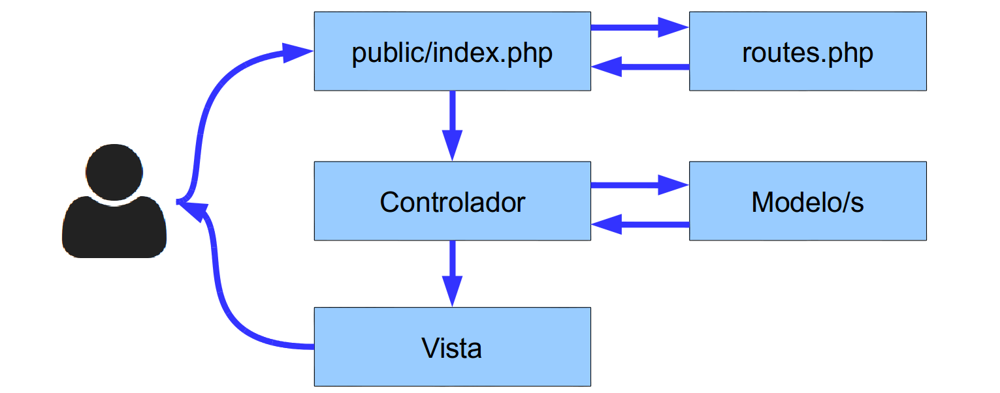

# Funcionamiento básico


<!-- ************************************************************************-->
# Estructura de un proyecto

Al crear un nuevo proyecto de Laravel se nos generará la siguiente estructura de carpetas y ficheros:

* `/app` – Contiene los controladores, modelos, vistas y configuraciones de la aplicación. En esta carpeta escribiremos la mayoría del código para que nuestra aplicación funcione.

* `/public` – Es la única carpeta pública, la única que debería ser visible en nuestro servidor web. Todo las peticiones y solicitudes a la aplicación pasan por esta carpeta, ya que en ella se encuentra el `index.php`, este archivo es el que inicia todo el proceso de ejecución del framework. En este directorio también se alojan los archivos CSS, Javascript, imágenes y otros archivos que se quieran hacer públicos.

* `/vendor` – En esta carpeta se alojan todas las librerías que conforman el framework y sus dependencias.

* `/app/lang` – En esta carpeta se guardan archivos PHP que contienen arrays con los textos de nuestro sitio web en diferentes lenguajes, solo será necesario utilizarla en caso que se desee que la aplicación se pueda traducir.

* `/app/config` – Aquí se encuentran todos los archivos de configuración de la aplicación: base datos, cache, correos, sesiones o cualquier otra configuración general de la aplicación.

* `/app/controller` – Contiene todos los archivos con las clases de los controladores que sirven para interactuar con los modelos, las vistas y manejar la lógica de la aplicación.

* `/app/model` – Los modelos son clases que representan la información (datos) de la aplicación y las reglas para manipularlos. En la mayoría de los casos cada tabla de la base datos esta representada con un modelo. La lógica de negocio de la aplicación está contendía en los modelos.

* `/app/views` – Este directorio contiene las vistas de nuestra aplicación. En general serán plantillas de HTML que usan los controladores para mostrar la información. Hay que tener en cuenta que en esta carpeta no se almacenan los Javascript, CSS o imágenes, ese tipo de archivos se tienen que guardar en la carpeta `/public`.

* `/app/storage` – En esta carpeta Laravel almacena toda su información interna necesaria para la ejecución de la web, como son los archivos de sesión, la caché, la compilación de las vistas, meta información y los logs del sistema.

* `/app/filter.php` – Este fichero contiene los filtros que podemos utilizar para validación del uso de determinadas rutas o secciones de la web.

* `/app/routes.php` – Este documento define todas las rutas de nuestro sitio web, enlazando una URL del navegador con un método de un controlador. Además nos permite realizar validaciones y otras operaciones sobre las rutas de nuestro sitio.

* `composer.json` – Este fichero es el utilizado por Composer para realizar la instalación de Laravel. En una instalación inicial únicamente se especificará la instalación de un paquete, el propio _framework_ de Laravel, pero podemos especificar la instalación de otras librerías o paquetes que añadan funcionalidad a Laravel.


<!-- ************************************** -->
## Funcionamiento básico

El funcionamiento básico que sigue Laravel tras una petición web a una URL de nuestro sitio es el siguiente:

* Todas las peticiones entran a través del fichero `index.php`, el cual en primer lugar comprobará en el fichero de rutas (`routes.php`) si la URL es válida y en caso de serlo a que controlador tiene que hacer la petición.

* A continuación se llamará al método del controlador asignado para dicha ruta. Como hemos visto, el controlador es el punto de entrada de las peticiones del usuario, el cual, dependiendo de la petición:
  * Accederá a la base de datos (si fuese necesario) a través de los "modelos" para obtener datos (o para añadir, modificar o eliminar).
  * Tras obtener los datos necesarios los preparará para pasárselos a la vista.

* En el tercer paso el controlador llamará a una vista con una serie de datos asociados, la cual se preparará para mostrarse correctamente a partir de los datos de entrada y por último se mostrará al usuario.

A continuación se incluye un pequeño esquema de este funcionamiento:



En las siguientes secciones iremos viendo cada uno de estos apartados por separado. En primer lugar se estudiará como podemos definir las rutas que tiene nuestra aplicación y como las tenemos que enlazar con los controladores. Seguidamente se verán los controladores y vistas, dejando los modelos de datos y el uso de la base de datos para más adelante.


<!-- ************************************************************************-->
# Rutas

Las rutas de nuestra aplicación aplicación se tienen que definir en el fichero `app/routes.php`. Como hemos visto este es el punto centralizado para la definición de rutas, y cualquier ruta no definida en este fichero no será válida, generado una excepción (lo que devolverá un error 404).

Las rutas, en su forma más sencilla, pueden devolver directamente un valor desde el propio fichero de rutas, pero también podrán generar la llamada a una vista o a un controlador. Empezaremos viendo el primer tipo de rutas y en secciones posteriores se tratará como enlazarlas con una vista o con un controlador.


<!-- ************************************** -->
## Rutas básicas

Las rutas, además de definir la URL de la petición, también indican el método con el cual se ha de hacer dicha petición. Los dos métodos más utilizados y que empezaremos viendo son las peticiones tipo GET y tipo POST. Por ejemplo, para definir una petición tipo GET tendríamos que añadir el siguiente código a nuestro fichero `routes.php`:


```php
Route::get('/', function()
{
    return '¡Hola mundo!';
});
```

Este código se lanzaría cuando se realice una petición tipo GET a la ruta raíz de nuestra aplicación. Si estamos trabajando en local esta ruta sería `http://localhost` pero cuando la web esté en producción se referiría a la dirección `http://www.dirección-de-tu-web.com`. Es importante indicar que si se realiza una petición tipo POST se devolvería un error ya que esa ruta no está definida.

Para definir una ruta tipo POST se realizaría de la misma forma pero cambiando el verbo GET por POST:

```php
Route::post('foo/bar', function()
{
    return '¡Hola mundo!';
});
```

En este caso la ruta apuntaría a la dirección URL `foo/bar` (`http://localhost/foo/bar` o `http://www.dirección-de-tu-web.com/foo/bar`).

Si queremos que una ruta se defina a la vez para varios verbos lo podemos hacer añadiendo un array con los tipos, de la siguiente forma:

```php
Route::match(array('GET', 'POST'), '/', function()
{
    return '¡Hola mundo!';
});
```

O para cualquier tipo de petición HTTP utilizando el método `any`:

```php
Route::any('foo', function()
{
    return '¡Hola mundo!';
});
```


<!-- ************************************** -->
## Añadir parámetros a las rutas

Si queremos añadir parámetros a una ruta simplemente los tenemos que indicar entre llaves `{}` a continuación de la ruta, de la forma:

```php
Route::get('user/{id}', function($id)
{
    return 'User '.$id;
});
```

En este caso estamos definiendo la ruta `/user/{id}`, donde `id` es requerido y puede ser cualquier valor. En caso de no especificar ningún `id` se produciría un error. El parámetro se le pasará a la función, el cual se podrá utilizar (como veremos más adelante) para por ejemplo obtener datos de la base de datos, almacenar valores, etc.


También podemos indicar que un parámetro es opcional simplemente añadiendo el símbolo `?` al final (y en este caso no daría error si no se realiza la petición con dicho parámetro):

```php
Route::get('user/{name?}', function($name = null)
{
    return $name;
});

// También podemos poner algún valor por defecto...

Route::get('user/{name?}', function($name = 'Javi')
{
    return $name;
});
```

Laravel también permite el uso de expresiones regulares para validar los parámetros que se le pasan a una ruta. Por ejemplo, para validar que un parámetro esté formado solo por letras o solo por números:

```php
Route::get('user/{name}', function($name)
{
    //
})
->where('name', '[A-Za-z]+');

Route::get('user/{id}', function($id)
{
    //
})
->where('id', '[0-9]+');

// Si hay varios parámetros podemos validarlos usando un array:

Route::get('user/{id}/{name}', function($id, $name)
{
    //
})
->where(array('id' => '[0-9]+', 'name' => '[A-Za-z]+'))
```


<!-- ************************************** -->
## Generar una ruta

Cuando queramos generar la URL hasta una ruta podemos utilizar el siguiente método:

```php
$url = URL::to('foo');
```

Con este método nos aseguraremos que la URL sea válida y además se le añadirá el dominio que tengamos definido en los ficheros de configuración. En general no será necesaria su utilización y simplemente podremos escribir la ruta a mano hasta una dirección de la forma: `/foo` (anteponiendo la barra `/` para asegurarnos que la ruta sea a partir de la raíz del dominio de nuestro sitio.


<!-- ************************************************************************-->
# _Artisan_

Laravel incluye un interfaz de línea de comandos (CLI, _Command line interface_) llamado _Artisan_. Esta utilidad nos va a permitir realizar múltiples tareas necesarias durante el proceso de desarrollo o despliegue a producción de una aplicación, por lo que nos facilitará y acelerará el trabajo.

Para ver una lista de todas las opciones que incluye Artisan podemos ejecutar el siguiente comando en un consola o terminal del sistema en la carpeta raíz de nuestro proyecto:

```bash
php artisan list

# O simplemente:
php artisan
```

Si queremos obtener una ayuda más detallada sobre alguna de las opciones de Artisan simplemente tenemos que escribir la palabra _help_ delante del comando en cuestión, por ejemplo:

```bash
php artisan help migrate
```


En secciones anteriores ya hemos utilizado uno de estos comandos, `php artisan key:generate`, para generar la clave de encriptación de nuestro proyecto Web. Poco a poco iremos viendo más opciones de Artisan.

Por ejemplo, para ver un listado con todas las rutas que hemos definido en el fichero `routes.php` podemos ejecutar el comando:

```bash
php artisan routes
```


<!-- ************************************************************************-->
# Vistas

Las vistas son la forma de presentar el resultado (una pantalla de nuestro sitio web) de forma visual al usuario, el cual podrá interactuar con él y volver a realizar una petición. Las vistas además nos permiten separar toda la parte de presentación de resultados de la lógica (controladores) y de la base de datos (modelos). Por lo tanto no tendrán que realizar ningún tipo de consulta ni procesamiento de datos, simplemente recibirán datos y los prepararán para mostrarlos como HTML.

Las vistas se almacenan en la carpeta `app/views` como ficheros PHP. Contendrán el código HTML de nuestro sitio web, mezclado con los assets (CSS, imágenes, Javascripts, etc. que estarán almacenados en la carpeta `public`) y algo de código PHP (o código _Blade_ de plantillas, como veremos más adelante) para presentar los datos de entrada como un resultado HTML.

A continuación se incluye un ejemplo de una vista simple, almacenada en el fichero `app/views/home.php`, que simplemente mostrará por pantalla `¡Hola <nombre>!`, donde `<nombre>` es una variable que la vista tiene que recibir como entrada para poder mostrarla.

```html
<html>
    <head>
        <title>Mi Web</title>
    </head>
    <body>
        <h1>¡Hola <?php echo $name; ?>!</h1>
    </body>
</html>
```

Ya tenemos nuestra primera vista, pero ahora tenemos que asociarla a una ruta para poder mostrarla. Para esto tenemos que ir al fichero `routes.php` como hemos visto antes y escribir el siguiente código:

```php
Route::get('/', function()
{
    return View::make('home', array('name' => 'Javi'));
});
```

En este caso estamos definiendo que la ruta se devuelva cuando se haga una petición tipo GET a la raíz de nuestro sitio. El único cambio que hemos hecho ha sido en el valor devuelto por la función, el cual genera la vista con `View::make` y la devuelve. Esta función recibe como parámetros:
* El nombre de la vista: `home` el cual será un fichero almacenado en la carpeta `views`, acordaros que la vista anterior de ejemplo la habíamos guardado en `app/views/home.php`. Para indicar el nombre de la vista se utiliza el mismo nombre del fichero pero sin la extensión `.php`.
* Un array de datos que se le pasarán a la vista. En este caso la vista recibirá una variable llamada `$name` con valor "Javi".


A la hora de pasar datos a una vista tenemos más alternativas (todas son equivalentes), usando el método `with` o el método `with<VarName>`, donde `<VarName>` es el nombre de la variable:

```php
// Usando el método with:
$view = View::make('home')->with('name', 'Javi');

// Usando el método with "mágico"!:
$view = View::make('home')->withName('Javi');
```

En los ejemplos anteriores obtendríamos el mismo resultado, se le paría una variable con nombre `$name` a la vista con el valor "Javi".


## Vistas dentro de vistas

Laravel también permite anidar vistas, es decir, renderizar una vista dentro de otra vista. Por ejemplo, si queremos mostrar la vista almacenada en `app/views/partials/view.php` dentro de la vista que habíamos creado en el ejemplo anterior (`app/views/home.php`), tendríamos que hacer lo siguiente:


```php
$view = View::make('home')->nest('content', 'partials.view');

// También podemos pasarle datos a la vista hija...
$view = View::make('home')->nest('content', 'partials.view', $data);
```

El código anterior generaría la vista padre (`home`) y en su variable `content` colocaría la vista hija `partials.view`. Para indicar la ruta hasta vistas que están almacenadas dentro de carpetas, en lugar de escribir la barra `/` como separador se utiliza el punto (`.`).

```html
<html>
    <body>
        <h1>¡Hola!</h1>
        <?php echo $content; ?>
    </body>
</html>
```


<!-- ************************************************************************-->
# Plantillas mediante _Blade_

Laravel utiliza _Blade_ para la definición de plantillas en las vistas. Esta librería permite realizar todo tipo de operaciones con los datos, además de la sustitución de secciones de las plantillas por otro contenido, herencia entre plantillas, definición de _layouts_ o plantillas base, etc.

Los ficheros de vistas que utilizan el sistema de plantillas _Blade_ tienen que tener la extensión `.blade.php`. Esta extensión tampoco se tendrá que incluir a la hora de referenciar una vista desde el fichero de rutas o desde un controlador. Es decir, utilizaremos `View::make('home')` tanto si el fichero se llama `home.php` como `home.blade.php`.

En general el código que incluye _Blade_ en una vista empezará por los símbolos `@` o `{{`, el cual posteriormente será procesado y preparado para mostrarse por pantalla.

El método más básico que tenemos en _Blade_ es el de mostrar datos, para esto utilizaremos las triples llaves (`{{{ }}}`) como se muestra a continuación:


```html
Hola {{{ $name }}}!.
La hora actual es {{{ time() }}}.
```

Podemos mostrar el contenido de una variable o incluso llamar a una función para mostrar su resultado. Si por ejemplo queremos comprobar que una variable existe o tiene un determinado valor, podríamos utilizar el operador ternario de la forma:

```html
{{{ isset($name) ? $name : 'Default' }}}
```

O simplemente usar la notación que incluye _Blade_ para este fin:

```html
{{{ $name or 'Default' }}}
```


Al utilizar las triples llaves (`{{{ }}}`) _Blade_ escapa los datos a mostrar, evitando posibles errores. Si no queremos que escape los datos simplemente tendremos que utilizar la doble llave (`{{ }}`) de la forma:

```html
Hola {{ $name }}!.
```

> Nota: En general tendremos que usar las triples llaves siempre que vayamos a mostrar datos que son proporcionados por los usuarios de la aplicación. Esto evitará que inyecten símbolos que produzcan errores.


Para definir comentarios se utilizan los símbolos `{{--` y `--}}`, por ejemplo:

```html
{{-- Este comentario no se mostrará en HTML --}}
```


<!-- *********************************** -->
## Estructuras de control

_Blade_ nos permite utilizar la estructura `if` de las siguientes formas:

```html
@if( count($users) === 1 )
    Solo hay un usuario!
@elseif (count($users) > 1)
    Hay muchos usuarios!
@else
    No hay ningún usuario :(
@endif
```

En los siguientes ejemplo se puede ver como realizar bucles tipo _for_, _while_ o _foreach_:

```html
@for ($i = 0; $i < 10; $i++)
    El valor actual es {{ $i }}
@endfor

@while (true)
    <p>Soy un bucle while infinito!</p>
@endwhile

@foreach ($users as $user)
    <p>Usuario {{ $user->name }} con identificador: {{ $user->id }}</p>
@endforeach
```


<!-- *********************************** -->
## Incluir una plantilla dentro de otra plantilla


En _Blade_, dentro de una plantilla, podemos indicar que se incluyan otras plantillas utilizando la instrucción `@include`:

```html
@include('view_name')

<!-- También podemos pasarle un array de datos como segundo parámetro -->
@include('view_name', array('some'=>'data'))
```


<!-- *********************************** -->
## _Layouts_

_Blade_ también nos permite la definición de _layouts_ para crear una estructura HTML base con secciones que serán rellenadas por otras plantillas. Por ejemplo, crear un _layout_ con las etiquetas principales de HTML (_head_, _body_, etc.) y una serie de secciones que serán rellenados por otras plantillas para completar el código. Este _layout_ puede ser utilizado para todas las pantallas de nuestro sitio web, lo que nos permite que en el resto de plantillas no tengamos que repetir todo este código.

A continuación de incluye un ejemplo de una plantilla tipo _layout_ almacenada en el fichero `app/views/layouts/master.blade.php`:

```html
<html>
    <head>
        <title>Mi Web</title>
    </head>
    <body>
        @section('menu')
            Contenido del menu
        @show

        <div class="container">
            @yield('content')
        </div>
    </body>
</html>
```

Posteriormente, en otra plantilla, podemos decir que extienda el layout que hemos creado (`@extends('layouts.master')`) y que complete las dos secciones de contenido que habíamos definido en el mismo:

```html
@extends('layouts.master')

@section('menu')
    <p>Este condenido es añadido al menú principal.</p>
@stop

@section('content')
    <p>Este apartado aparecerá en la sección "content".</p>
@stop
```

Como se puede ver, las vistas que extiende un _layout_ simplemente tienen que sobreescribir las secciones del _layout_. La directiva `@section` permite ir añadiendo contenido en las plantillas hijas, mientras que `@yield` será sustituido por el contenido que se indique. Además, si queremos establecer un contenido por defecto para `@yield` lo podemos hacer como se muestra a continuación:


```html
@yield('section', 'Contenido por defecto')
```


