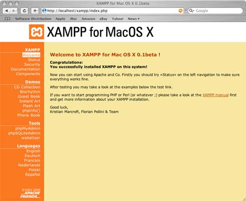

<!-- ************************************************************************-->
# Instalación de Laravel

Para la utilización de Laravel en primer lugar necesitamos tener instalado un servidor Web Apache con PHP >= 5.4, MySQL y la extensión MCrypt de PHP. Una vez instalado el servidor procederemos a instalar la utilidad Composer y por último la librería de Laravel. A continuación se describen los pasos a seguir.


<!-- ********************************** -->
## Instalación del servidor Web XAMPP

Como servidor Web para Mac vamos a utilizar la versión de XAMPP de ApacheFriends. Para su instalación seguiremos los siguientes pasos:

* En primer lugar abrimos su página web "https://www.apachefriends.org", entramos en la sección de descargas y bajamos la última versión para Mac.

* Esto descargará una imagen tipo DMG (en el caso de Mac), hacemos doble clic encima para iniciar el proceso de instalación.

* Al finalizar habrá instalado el servidor en la ruta `/Applications/XAMPP`.

Con esto ya tenemos un servidor Web instalado en nuestro ordenador. Ahora para iniciarlo y pararlo solo tendremos que acceder a su Panel de Control e iniciar o parar Apache y MySQL. El nombre de la aplicación de Panel de Control de XAMPP es "**manager-osx**".

Desde este mismo panel de control, además de poder iniciar o parar los servicios, podemos ver el log, abrir la carpeta de disco donde tenemos que almacenar nuestro proyectos Web (por defecto situada en `/Applications/XAMPP/htdocs`) o abrir la URL de nuestro servidor web en un navegador (http://localhost/xampp/).

Para comprobar que el servidor se ha instalado correctamente podemos abrir la siguiente URL en el navegador:

```bash
http://localhost
```

Esto nos mostrará la página por defecto de XAMPP, que contiene algunos links para comprobar el estado del software instalado y algunos ejemplos de programación.




> Si ya hubiese un servidor web instalado en el ordenador es posible que entre en conflicto con XAMPP y no permita iniciar el servicio de Apache. En este caso tendremos que detener el otro servidor (`sudo apachectl stop`) para poder utilizar XAMPP.


Desde la versión 4 de Laravel, la creación de un proyecto nuevo se realiza con Composer. Veamos entonces que es Composer y que necesitamos para usarlo.


<!-- ********************************** -->
## Instalación de Composer

Composer es un gestor de dependencias para PHP. Esto quiere decir que permite descargar de sus repositorios todas las librerías y las dependencias con las versiones requeridas que el proyecto necesite.

Instalar Composer es muy sencillo por linea de comandos. Si accedemos a su página web en "https://getcomposer.org/" podemos consultar las instrucciones, simplemente tendremos que hacer:

```bash
$ curl -sS https://getcomposer.org/installer | php
$ sudo mv composer.phar /usr/local/bin/composer
```


El primer comando descarga el archivo `composer.phar` en nuestro ordenador (.phar es una extensión para aplicaciones PHP comprimidas). El segundo comando mueve el archivo descargado a la carpeta `bin` para que Composer pueda ser ejecutado de forma global.

Por último verificamos la instalación con el siguiente comando:

```bash
$ composer
```

Si la instalación se ha realizado correctamente se nos debería mostrar una lista de los comandos y opciones que tiene Composer.


<!-- ********************************** -->
## Instalar Laravel mediante Composer

En la carpeta raíz de nuestro servidor web (`/Applications/XAMPP/htdocs`) ejecutamos el siguiente comando:

```bash
$ composer create-project laravel/laravel miweb --prefer-dist
```

Esto nos descargará la última versión de Laravel y creará una carpeta llamada `miweb` con todo el contenido ya preparado. Si nos apareciera algún error de permisos tendríamos que ejecutar de nuevo el mismo comando pero con sudo.

Si accedemos a la carpeta que se acaba de crear (`cd miweb`) y ejecutamos `$ php artisan` comprobaremos que nos aparece el siguiente error:

```bash
Mcrypt PHP extension required.
```

Esto es debido a que Laravel require la extensión Mcrypt para su utilización. En la siguiente sección se explica como solucionar este error.


<!-- ********************************** -->
## Instalación de Mcrypt

Para instalar Mcrypt seguiremos los siguientes pasos:

* Ejecutamos `which php` para comprobar la ruta del php utilizado, la cual deberá ser (`/usr/bin/php`).
* A continuación escribimos:

```bash
sudo nano ~/.bash_profile
```

* Al final de este fichero añadimos la siguiente línea:

```bash
PATH="/Applications/XAMPP/xamppfiles/bin:$PATH"
```

* Y por último presionamos Ctrl+O para guardar los cambios y Ctrl-X para salir.

Con esto hemos añadido al PATH del sistema la ruta de los ejecutables que incorpora XAMPP, entre los cuales se incluye Mcrypt. Para que se actualice el PATH cerramos el terminal actual y volvemos a abrir uno. Ahora si escribimos otra vez `which php` nos tendrá que aparecer la nueva ruta: `/Applications/XAMPP/xamppfiles/bin/php`. Para comprobar que ya funciona el CLI de Laravel accedemos a la ruta donde lo hemos instalado (`/Applications/XAMPP/htdocs/miweb`) y ejecutamos `php artisan`, lo cual nos tendría que mostrar:

```bash
Laravel Framework version 4.2.16

Usage:
  [options] command [arguments]

Options:
  --help
  ...
```

Con esto ya tenemos instalado un servidor Web y Laravel funcionando, pero todavía nos falta terminar de configurar nuestra nueva Web con Laravel para que funcione correctamente.


